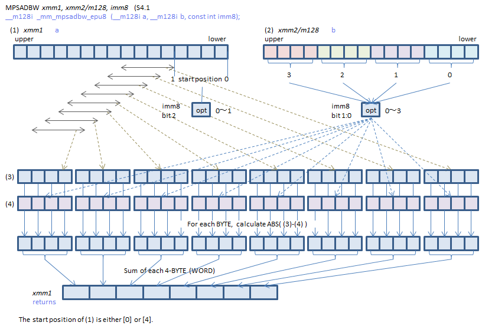

## Description
- CTF : https://x.com/CTF_Inter_IUT/
- Challmaker : Endeavxor
- Difficulté : Difficile
- Nombre de résolution : 1

## Reverse statique

Le binaire n'est pas bien grand, il a sûrement été codé directement en assembleur. Une des premières choses qui saute aux yeux sur le peu d'instructions présentes est l'exoticité *(d'où le nom du challenge)* de certaines d'entre elles : 

- `movaps`
- `pshufb`
- `mpsadbw`
- `pxor`
- `ptest`

Après rapide recherche elles appartient toutes au jeu d'instructions **SSE** inclus dans le jeu d'instructions x86. Ces instructions utilisent des registres particuliers (XMM0, XMM1, etc.) qui sont des registres sur **128 bits**. Elles implémentent des opérations ayant pour but d'être appliqué sur des vecteurs. **SSE** a pas mal évolué au fil du temps et plusieurs versions en ont découlé. Ici **mpsadbw** est issue de **SSE 4.1**. Pour plus d'informations : https://fr.wikipedia.org/wiki/Streaming_SIMD_Extensions 

Le cœur du challenge réside au sein de 10 instructions *(le bloc `second_check` qui suit étant une copie quasi-conforme)*: 

```asm
mov     eax, 0
mov     edi, 0          ; fd
mov     rsi, offset _edata ; buf
mov     edx, 10h        ; count
syscall                 ; LINUX - sys_read
movaps  xmm2, ds:_edata
pshufb  xmm2, xmm0
mpsadbw xmm2, xmm1, 1
pxor    xmm3, xmm2
ptest   xmm3, xmm3
```


Les premières instructions vont simplement récupérer **16 octets** depuis l'entrée utilisateur. `movaps` va ensuite récupérer notre entrée utilisateur *(qui fait 16 octets donc 128 bits)* pour la mettre dans **XMM2**. Puis `pshufb` est appliqué avec le contenu de **XMM0** qui est initialisé au début du binaire *(ne pas oublier le boutisme et qu'il faut donc commencer par la fin)* :

```asm
.text:0000000000401000                 movaps  xmm0, v0

.data:0000000000403010 v0              xmmword 30201000F0E0D0C0B0A090807060504h
```

### pshufb
> PSHUFB — Packed Shuffle Bytes :

> PSHUFB performs in-place shuffles of bytes in the destination operand (the first operand) according to the shuffle control mask in the source operand (the second operand). The instruction permutes the data in the destination operand, leaving the shuffle mask unaffected. If the most significant bit (bit[7]) of each byte of the shuffle control mask is set, then constant zero is written in the result byte. Each byte in the shuffle control mask forms an index to permute the corresponding byte in the destination operand. The value of each index is the least significant 4 bits (128-bit operation) or 3 bits (64-bit operation) of the shuffle control byte. When the source operand is a 128-bit memory operand, the operand must be aligned on a 16-byte boundary or a general-protection exception (#GP) will be generated.


Pour faire simple, la seconde opérande `xmm0` sera considéré comme un tableau de 16 octets, contenant chacun un index. `xmm2` *(notre entrée utilisateur)* sera mélangé en regardant la valeur de l'index présent dans `xmm0`. Par exemple :

- `xmm0` = [4,5,6,7,8,9,10,11,12,13,14,15,0,1,2,3]
- `xmm2` = IIUT{ABCDEFGHIJ}
- `pshufb`  xmm2, xmm0
- `xmm2` => {ABCDEFGHIJ}IIUT

Dans ce binaire, l'instruction va placer notre début de flag `IIUT` à la fin. 

### mpsadbw

Les instructions suivantes étant `pxor` et `ptest` le point central du challenge réside dans l'instruction `mpsadbw` qui est loin d'être trivial : 


> MPSADBW — Compute Multiple Packed Sums of Absolute Difference :

>(V)MPSADBW calculates packed word results of sum-absolute-difference (SAD) of unsigned bytes from two blocks of 32-bit dword elements, using two select fields in the immediate byte to select the offsets of the two blocks within the first source operand and the second operand. Packed SAD word results are calculated within each 128-bit lane. Each SAD word result is calculated between a stationary block_2 (whose offset within the second source operand is selected by a two bit select control, multiplied by 32 bits) and a sliding block_1 at consecutive byte-granular position within the first source operand. The offset of the first 32-bit block of block_1 is selectable using a one bit select control, multiplied by 32 bits.


L'image est un peu plus parlante :




Le second argument, dans notre cas `xmm1` *(initialisé au début du binaire)*:
```
.text:0000000000401008                 movaps  xmm1, v1

.data:0000000000403020 v1              xmmword 4F1E7A540A2C21684F1E7A544F1E7A54h
```

est considéré comme 4 blocs de 4 octets chacun *(faisant donc bien 128 bits au final)*. Le dernier paramètre, ici `1`, a un double usage :

- Avec les 2 bits de poids faible : il choisit un de ces 4 blocs en partant de la droite et en commençant à 0. Dans notre cas, le bloc sélectionné est :

`[84, 122, 30, 79]`


- Avec le 3e bit de poids faible : définit un offset sur le premier paramètre où aligner ce bloc sélectionné. Valant `0` dans notre cas cela n'aura pas d'importance et ce bloc commencera à droite.


L'instruction va finalement effectuer la somme de la différence absolue entre notre bloc sélectionné et 4 octets de `xmm2` *(notre entrée utilisateur mélangée)*, en commençant donc par la droite et en de décalant d'un octet vers la gauche une fois cela fait. Cette opération est répétée 8 fois *(et non 16 car le résultat de l'addition tient sur 2 octets)* afin de remplir `xmm2`.


### pxor

Une fois l'instruction exécutée, son résultat est xorée avec `xmm3` *(initialisé au début du binaire)* : 

```asm
.text:0000000000401010                 movaps  xmm3, v3

.data:0000000000403030 v3              xmmword 0A400570099009300BD00B4009B0081h
```


### ptest

L'instruction sert juste à vérifier que le résultat du `xor` soit `0` et qu'on aurait donc entré le bon flag.


### Reste du binaire

La même suite d'opération est effectué une seconde fois *(afin d'obtenir l'unicité sur la solution)* sur l'entrée utilisateur avec des valeurs différentes uniquement pour le `xor` et `mpsadbw` qui prendre cette fois ci le bloc `0x2`


## Résolution

Ici l'utilisation de z3 est quasi indispensable pour résoudre rapidement le challenge. Il faut cependant bien noter que la modification du format de flag avait un intérêt. Comme `mpsadbw` décale d'un seul octet vers la gauche et ce 8 fois, on ne peut pas couvrir l'intégralité du flag. 

Imaginons notre flag `IIUT{ABCDEFGHIJ}`

- `pshufb` va placer `IIUT` à la fin du flag nous aurons donc : `{ABCDEFGHIJ}IIUT`
- `mpsadbw` est appliqué uniquement sur les 11 premiers octets *(4 initialement puis décalage de 1 par 1, 8 fois)*, donc :

```
{ABC
ABCD
BCDE
CDEF
DEFG
EFGH
FGHI
GHIJ
```

- Le morceau non traité sera donc `}IIUT` mais il est connu d'avance donc non nécessaire


```py
from z3 import *

xmm2_a = [84, 122, 30, 79]
xmm2_b = [104, 33, 44, 10]

xor_xmm3 = [129,155,180,189,147,153,87,164]
xor_xmm4 = [101,143,232,259,291,199,139,126]


s = Solver()
flag = [BitVec(f"flag_{i}", 16) for i in range(11)]

xor_xmm3_16 = [BitVecVal(xor_xmm3[0], 16), BitVecVal(xor_xmm3[1], 16), BitVecVal(xor_xmm3[2], 16), BitVecVal(xor_xmm3[3], 16)]
xor_xmm4_16 = [BitVecVal(xor_xmm4[0], 16), BitVecVal(xor_xmm4[1], 16), BitVecVal(xor_xmm4[2], 16), BitVecVal(xor_xmm4[3], 16)]

for i in range(11):
    s.add(flag[i] >= 33)
    s.add(flag[i] <= 126)

for i in range(8):
    sum_abs_diff_a = Abs(flag[i] - xmm2_a[0]) + Abs(flag[i+1] - xmm2_a[1]) + Abs(flag[i+2] - xmm2_a[2]) + Abs(flag[i+3] - xmm2_a[3])
    sum_abs_diff_b = Abs(flag[i] - xmm2_b[0]) + Abs(flag[i+1] - xmm2_b[1]) + Abs(flag[i+2] - xmm2_b[2]) + Abs(flag[i+3] - xmm2_b[3])
    s.add(sum_abs_diff_a == xor_xmm3[i])
    s.add(sum_abs_diff_b == xor_xmm4[i])


if s.check() == sat:
    model = s.model()
    final_flag = "IIUT"
    for i in range(11):
        final_flag+= chr(model.eval(flag[i]).as_long())
    print("Flag :", final_flag + "}")
else:
    print("Aucune solution trouvée.")
```

**Flag : IIUT{5&BKpyt).r}**
