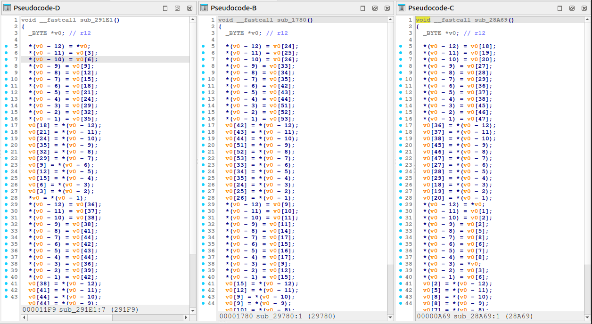
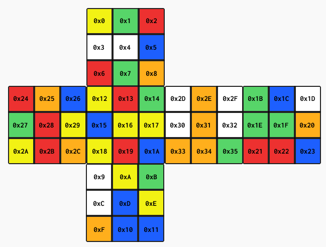
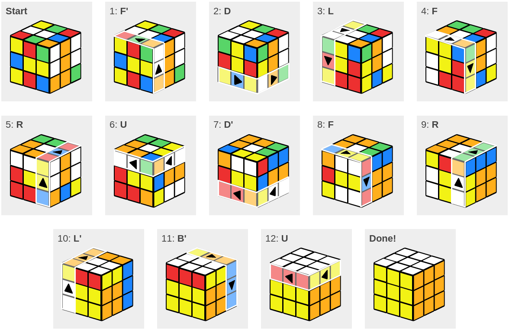

## Description 

- CTF : https://shutlock.fr
- Nombre de résolution : 2 / 621
- Difficulté : Difficile

## Reverse statique

*N.B. Les extraits de codes sont issus du pseudo-décompilateur d'IDA. De plus j'ai renommé beaucoup de variables afin de faciliter la lecture, cela n'était pas aussi direct/simple en l'état lors du CTF*

```sh
reverseMe: ELF 64-bit LSB executable, x86-64, version 1 (SYSV), statically linked, BuildID[sha1]=a27ae3082ab9dfee3e301d250d24e25d208a2b2e, for GNU/Linux 3.2.0, stripped, too many notes (256)
```

Le binaire est **lié statiquement et sans symbole**, ce qui risque de ralentir la phase de rétro-conception, cependant certains patterns présents dans le binaire permettent de récupérer la signature de certaines fonctions de la libc utilisée et ainsi de ne pas les analyser *inutilement*.

La fonction **main** est découpée en plusieurs blocs : 

- **Contrôle d'intégrité** de la fonction **main** :
```c
  randomCounter = 0;
  v1 = 0x76DC419;
  qmemcpy(bufferRandomValues, &hardcodedRandomValues, sizeof(bufferRandomValues));
  v37 = -125;
  do
  {
    v2 = random();
    randomCounter += v2 + v2 / 0xFFFFFFFFLL;
    --v1;
  }
  while ( v1 );
  v3 = startMainAddr;
  v4 = -1;
  do
  {
    v5 = *(_BYTE *)v3;
    v6 = v4 >> 1;
    if ( ((*(_BYTE *)v3 ^ (unsigned __int8)v4) & 1) != 0 )
      v6 = (randomCounter ^ v6) - (((randomCounter ^ v6) != -1) - 1);
    v7 = v6 >> 1;
    if ( (((v5 >> 1) ^ (unsigned __int8)v6) & 1) != 0 )
      v7 = (randomCounter ^ v7) - (((randomCounter ^ v7) != -1) - 1);
    v8 = v7 >> 1;
    if ( (((v5 >> 2) ^ (unsigned __int8)v7) & 1) != 0 )
      v8 = (randomCounter ^ v8) - (((randomCounter ^ v8) != -1) - 1);
    v9 = v8 >> 1;
    if ( (((v5 >> 3) ^ (unsigned __int8)v8) & 1) != 0 )
      v9 = (randomCounter ^ v9) - (((randomCounter ^ v9) != -1) - 1);
    v10 = v9 >> 1;
    if ( (((v5 >> 4) ^ (unsigned __int8)v9) & 1) != 0 )
      v10 = (randomCounter ^ v10) - (((randomCounter ^ v10) != -1) - 1);
    v11 = v10 >> 1;
    if ( (((v5 >> 5) ^ (unsigned __int8)v10) & 1) != 0 )
      v11 = (randomCounter ^ v11) - (((randomCounter ^ v11) != -1) - 1);
    v12 = v11 >> 1;
    if ( (((v5 >> 6) ^ (unsigned __int8)v11) & 1) != 0 )
      v12 = (randomCounter ^ v12) - (((randomCounter ^ v12) != -1) - 1);
    v4 = v12 >> 1;
    if ( (((v5 >> 7) ^ (unsigned __int8)v12) & 1) != 0 )
      v4 = (randomCounter ^ v4) - (((randomCounter ^ v4) != -1) - 1);
    v3 = (__int64 (__fastcall *)())((char *)v3 + 1);
  }
  while ( v3 != (__int64 (__fastcall *)())((char *)startMainAddr + 0x466) );
  v32 = v4;
  for ( i = 0LL; i != 0x19A5; ++i )
  {
    v14 = *((_BYTE *)bufferRandomValues + i) ^ v33[(i & 3) - 4];
    *((_BYTE *)bufferRandomValues + i) = v14;
    v1 += v14;
  }
  if ( v1 != 0xCB7A9 )
  {
    v15 = getppid();
    libc_sys_kill(v15, 11);
  }
```


Cette partie vérifie qu'il n'y a pas eu d'altération de la fonction **main** lors de son exécution, auquel cas, le programme s'arrête avec **kill**. Ce type de vérification a sûrement pour objectif d'empêcher les debuggers classiques tel que **gdb** de placer des points d'arrêt **logiciels**, ces derniers injectant souvent à l'instruction souhaitée  **int 0xCC** afin de récupérer le flux. Cependant cela ne pose pas de soucis avec des points d'arrêts **matériels**. En ce qui concerne le **random()**, il est initialisé avec **une graine de 1** par défaut ce qui explique que le concepteur du challenge peut pré-calculer la somme de contrôle.

- Mise en place du flag

```c
  v16 = ftok("/proc/self/exe", 0x41LL);
  if ( v16 == -1
    || (v17 = libc_shmget(v16, 0x400LL, 950LL), v31 = v17, v17 == -1)
    || (v22 = libc_shmmat(v17, 0LL, 0LL), v22 == -1) )
  {
    printf("Oops there is a problem :");
    exit(0xFFFFFFFFLL);
  }
  printf((unsigned int)"Password :", 0, v18, v19, v20, v21);
  fflush(off_4AB790);
  read(0LL, userInputBuffer, 6LL);
  v23 = userInputBuffer[1];
  v24 = userInputBuffer[0];
  v25 = userInputBuffer[1] / 0xCu;
  *(_QWORD *)v22 = (userInputBuffer[5] % 0xCu) | (((userInputBuffer[5] / 0xCu) | (((userInputBuffer[4] % 0xCu) | (((userInputBuffer[4] / 0xCu) | (((userInputBuffer[3] % 0xCu) | (((userInputBuffer[3] / 0xCu) | (((userInputBuffer[2] % 0xCu) | ((unsigned __int64)(userInputBuffer[2] / 0xCu) << 8)) << 8)) << 8)) << 8)) << 8)) << 8)) << 8);
  *(_DWORD *)(v22 + 8) = (unsigned __int8)(v23 - 12 * v25) | ((v25 | ((((unsigned __int8)v24 % 0xCu) | (((unsigned __int8)v24 / 0xCu) << 8)) << 8)) << 8);
```

Ce bloc va dans un premier temps faire appel à **shmget** et **shmmat** qui vont mettre en place un segment mémoire partagé au sein du processus. Cela peut indiquer l'usage de **fork** par la suite permettant aux processus enfants d'utiliser cette mémoire pour faire de l'intercommunication.

L'entrée utilisateur est récupérée, et subit une suite d'opérations qui n'est pas évidente à interpréter dans cette vue ni dans sa logique *(mais qui prendra tout son sens par la suite)*. Pour faire simple, pour chaque caractère, on place successivement dans la mémoire partagée deux éléments : 

- sa partie entière après division par **12**
- son reste après division par **12**

Le placement des caractères n'est pas dans l'ordre, mais cela n'a pas d'importance pour le moment.

- Cœur du challenge 

```c
  if ( (unsigned int)fork() )
  {
    do
      v29 = *(_BYTE *)(sharedMemory + 12);
    while ( !v29 );
    if ( v29 == 79 )
      puts("\nGG you can validate !");
    else
      puts("\nNope !");
  }
  else
  {
    v26 = (char *)bufferRandomValues;
    do
    {
      v27 = *v26++;
      *(v26 - 1) = (random() % 255) ^ v27;
    }
    while ( v26 != &v38 );
    bufferRandomValues[34] = fd_shared_memory_cp;
    fd_RAM_file = libc_memfd_create(&anon_name, 0LL);
    write(fd_RAM_file, bufferRandomValues, 6565LL);
    v35[1] = 0LL;
    v35[0] = (__int64)&anon_name;
    v34 = 0LL;
    fexecve(fd_RAM_file, v35, &v34);
  }
  fflush(off_4AB790);
  libc_shmdt(sharedMemory);
  sub_424100(fd_shared_memory_cp, 0LL, 0LL);
  return 0LL;
}
```

Le dernier bloc constitue le cœur du challenge. Un **fork** est effectué :

- Le **processus parent** réalise des vérifications sur une zone mémoire ne contenant pas l'entrée utilisateur et ne nous intéresse donc pas vraiment
- Dans le **processus fils**, le tampon contenant les valeurs aléatoires est xorée avec des valeurs pseudo-aléatoires *(mais prédictible par le concepteur du challenge car la graine est de 1)*, l'identifiant de la **mémoire partagée** est mise à l'offset **34** et **fexecve** est appelé, remplacant le processus fils par un **nouveau processus** dont le code est le contenu du tampon déchiffré. 

**bufferRandomValues** est donc un **shellcode** auquel lui est passé l'identifiant de la mémoire partagé à l'offset **34** afin qu'il puisse y récupérer l'entrée utilisateur décomposée.

L'objectif va être donc de récupérer le contenu de ce shellcode, pour cela plusieurs méthodes existent, je vais opter pour la plus rapide *(la sortie est volontairement tronquée)* :

```sh
endeavxor@deb:~/ShutlockCTF$ strace -f -s 6565 -x ./reverseMe
[...]

[pid 397709] write(3, "\x7f\x45\x4c\x46\x01\x01\x01\x00\x00\x00\x00\x00\x00\x00\x00\x00\x02\x00\x3e\x00\x01\x00\x00\x00\x78\x80\x02\x00\x00\x00\x00\x00\x40\x00\x00\x00\x00\x00\x00\x00\x00\x00\x00\x00\x00\x00\x00\x00\x00\x00\x00\x00\x40\x00\x38\x00\x01\x00\x40\x00\x00\x00\x00\x00\x01\x00\x00\x00\x05\x00\x00\x00\x00\x00\x00\x00\x00\x00\x00\x00\x00\x80\x02\x00\x00\x00\x00\x00\x00\x80\x02\x00\x00\x00\x00\x00\xa5\x19\x00\x00\x00\x00\x00\x00\xa5\x19\x00\x00\x00\x00\x00\x00\x00\x00\x20\x00\x00\x00\x00\x00\x31\xc9\xe8\x37\x01\x00\x00\x49\x89\xc4\xb8\x1e\x00\x00\x00\xbf\x28\x00\x0c\x00\xbe\x00\x00\x00\x00\xba\x00\x00\x00\x00\x0f\x05\x48\x83\xf8\xff\x7c\x05\x4d\x31\xc0\xeb\x0e\xb8\x3c\x00\x00\x00\x48\xc7\xc7\xff\xff\xff\xff\x0f\x05\x49\x83\xf8\x0c\x0f\x84\xe9\x00\x00\x00\x42\x80\x3c\x00\x00\x49\xb9\x88\x88\x02\x00\x00\x00\x00\x00\

[...]
```

Une fois le shellcode récupéré on peut le désassembler avec **capstone** ou directement dans **IDA** en forçant l'analyse du code pour identifier et définir les fonctions.

### Compréhension du shellcode

- Initialisation d'un tableau de 54 valeurs de **A** à **F**, pour le moment il est difficile de saisir à quoi ces valeurs correspondent :
```c
_BYTE *init_array54()
{
  _BYTE v1[54]; // [rsp+Ch] [rbp-36h] BYREF

  qmemcpy(v1, "CDEAABEDFACDABCFBBCEDBCCCEBDBADDFEEBEFBDECCEFAFAAFAFFD", sizeof(v1));
  return v1;
}
```


- Récupération de l'entrée utilisateur décomposée via **shmat** *(appel système 0x1E)* : 

```c
seg000:000000000002807F                 mov     r12, rax
seg000:0000000000028082                 mov     eax, 1Eh
seg000:0000000000028087                 mov     edi, 0C0028h
seg000:000000000002808C                 mov     esi, 0
seg000:0000000000028091                 mov     edx, 0
seg000:0000000000028096                 syscall                 ; Low latency system call
seg000:0000000000028098                 cmp     rax, 0FFFFFFFFFFFFFFFFh
seg000:000000000002809C                 jl      short exit_
seg000:000000000002809E                 xor     r8, r8
seg000:00000000000280A1                 jmp     short sub_280B1
```

- Cœur du shellcode : 

```c
seg000:00000000000280B1 sub_280B1       proc near               ; CODE XREF: seg000:00000000000280A1↑j
seg000:00000000000280B1                                         ; sub_280B1+EE↓j
seg000:00000000000280B1                 cmp     r8, 12
seg000:00000000000280B5                 jz      loc_281A4
seg000:00000000000280BB                 cmp     byte ptr [rax+r8], 0
seg000:00000000000280C0                 mov     r9, 28888h
seg000:00000000000280CA                 jz      loc_28199
seg000:00000000000280D0                 cmp     byte ptr [rax+r8], 1
seg000:00000000000280D5                 mov     r9, 286A7h
seg000:00000000000280DF                 jz      loc_28199
seg000:00000000000280E5                 cmp     byte ptr [rax+r8], 2
seg000:00000000000280EA                 mov     r9, 29780h
seg000:00000000000280F4                 jz      loc_28199
seg000:00000000000280FA                 cmp     byte ptr [rax+r8], 3
seg000:00000000000280FF                 mov     r9, 2959Fh
seg000:0000000000028109                 jz      loc_28199
seg000:000000000002810F                 cmp     byte ptr [rax+r8], 4
seg000:0000000000028114                 mov     r9, 29002h
seg000:000000000002811E                 jz      short loc_28199
seg000:0000000000028120                 cmp     byte ptr [rax+r8], 5
seg000:0000000000028125                 mov     r9, 28E23h
seg000:000000000002812F                 jz      short loc_28199
seg000:0000000000028131                 cmp     byte ptr [rax+r8], 6
seg000:0000000000028136                 mov     r9, 284C6h
seg000:0000000000028140                 jz      short loc_28199
seg000:0000000000028142                 cmp     byte ptr [rax+r8], 7
seg000:0000000000028147                 mov     r9, 282E5h
seg000:0000000000028151                 jz      short loc_28199
seg000:0000000000028153                 cmp     byte ptr [rax+r8], 8
seg000:0000000000028158                 mov     r9, 28C46h
seg000:0000000000028162                 jz      short loc_28199
seg000:0000000000028164                 cmp     byte ptr [rax+r8], 9
seg000:0000000000028169                 mov     r9, 28A69h
seg000:0000000000028173                 jz      short loc_28199
seg000:0000000000028175                 cmp     byte ptr [rax+r8], 0Ah
seg000:000000000002817A                 mov     r9, 293C0h
seg000:0000000000028184                 jz      short loc_28199
seg000:0000000000028186                 cmp     byte ptr [rax+r8], 0Bh
seg000:000000000002818B                 mov     r9, 291E1h
seg000:0000000000028195                 jz      short loc_28199
seg000:0000000000028197                 jmp     short loc_281A4
seg000:0000000000028199 ; ---------------------------------------------------------------------------
seg000:0000000000028199
seg000:0000000000028199 loc_28199:                              ; CODE XREF: sub_280B1+19↑j
seg000:0000000000028199                                         ; sub_280B1+2E↑j ...
seg000:0000000000028199                 call    r9 ; sub_28888
seg000:000000000002819C                 inc     r8
seg000:000000000002819F                 jmp     sub_280B1
seg000:00000000000281A4 ; ---------------------------------------------------------------------------
seg000:00000000000281A4
seg000:00000000000281A4 loc_281A4:                              ; CODE XREF: sub_280B1+4↑j
seg000:00000000000281A4                                         ; sub_280B1+E6↑j
seg000:00000000000281A4                 mov     r10, rax
seg000:00000000000281A7                 call    sub_29961
seg000:00000000000281AC                 mov     eax, 3Ch ; '<'
seg000:00000000000281B1                 xor     rdi, rdi
seg000:00000000000281B4                 syscall                 ; Low latency system call
seg000:00000000000281B4 sub_280B1       endp
```

Cette partie récupère l'entrée utilisateur décomposé, et itère sur les 12 valeurs. Ces valeurs doivent être compris entre **0x0 et 0xB** , ce qui est cohérent avec le quotient et le reste de la division par 12 réalisée plus haut. Selon la valeur présente, une fonction spécifique est appelée *(call r9)*. Enfin une fois les 12 fonctions appelées, la fonction **sub_29961** est appelé avant que le programme ne se termine : 

```c
seg000:0000000000029961 sub_29961       proc near               ; CODE XREF: sub_280B1+F6↑p
seg000:0000000000029961                 xor     rbx, rbx
seg000:0000000000029964                 mov     ecx, 41h ; 'A'
seg000:0000000000029969                 mov     r8d, 1
seg000:000000000002996F                 mov     dl, 9
seg000:0000000000029971                 jmp     short $+2
seg000:0000000000029973 ; ---------------------------------------------------------------------------
seg000:0000000000029973
seg000:0000000000029973 loc_29973:                              ; CODE XREF: sub_29961+10↑j
seg000:0000000000029973                                         ; sub_29961+2E↓j
seg000:0000000000029973                 cmp     rbx, 35h ; '5'
seg000:0000000000029977                 jz      short loc_2999F
seg000:0000000000029979                 cmp     [r12+rbx], cl
seg000:000000000002997D                 jnz     short loc_29999
seg000:000000000002997F                 mov     rax, r8
seg000:0000000000029982                 div     dl
seg000:0000000000029984                 cmp     ah, 0
seg000:0000000000029987                 jz      short loc_29991
seg000:0000000000029989
seg000:0000000000029989 loc_29989:                              ; CODE XREF: sub_29961+36↓j
seg000:0000000000029989                 inc     rbx
seg000:000000000002998C                 inc     r8
seg000:000000000002998F                 jmp     short loc_29973
seg000:0000000000029991 ; ---------------------------------------------------------------------------
seg000:0000000000029991
seg000:0000000000029991 loc_29991:                              ; CODE XREF: sub_29961+26↑j
seg000:0000000000029991                 inc     cl
seg000:0000000000029993                 mov     ax, 0
seg000:0000000000029997                 jmp     short loc_29989
seg000:0000000000029999 ; ---------------------------------------------------------------------------
seg000:0000000000029999
seg000:0000000000029999 loc_29999:                              ; CODE XREF: sub_29961+1C↑j
seg000:0000000000029999                 mov     byte ptr [r10+0Ch], 58h ; 'X'
seg000:000000000002999E                 retn
seg000:000000000002999F ; ---------------------------------------------------------------------------
seg000:000000000002999F
seg000:000000000002999F loc_2999F:                              ; CODE XREF: sub_29961+16↑j
seg000:000000000002999F                 mov     byte ptr [r10+0Ch], 4Fh ; 'O'
seg000:00000000000299A4                 retn
seg000:00000000000299A4 sub_29961       endp
```

Pour faire simple, la fonction va itérer sur le tableau initialisé au début du shellcode, *et modifié en fonction de l'entrée utilisateur,* en s'assurant qu'à la fin  les 9 premiers caractères soient **A**, les 9 suivants **B** et ainsi de suite jusqu'à **F**. 

On a ici beaucoup d'indicateurs sur ce que représente le challenge : 

- La miniature du challenge comporte un **Rubik's Cube**
- Le tableau du début contient **54** éléments tout comme le nombre de carrés d'un **Rubik's Cube**
- Le tableau contient aussi 9 fois les lettres {**A**, **B**, **C**, **D**, **E**, **F**} : Les lettres représentent donc les **6** faces de couleurs d'un **Rubik's Cube**
- La présence du **cube** dans le nom du challenge

Il s'agit donc de résoudre un **Rubik's Cube** qui est représenté linéairement dans le tableau. En ce qui concerne les fonctions appelées en fonction de l'entrée utilisateur, elles ont toute la même forme : 




**v0** représente ici le tableau de valeurs. Selon la fonction appelée, les valeurs subissent une permutation. Il s'agit en fait d'une rotation effectuée sur le **Rubik's Cube**. Après **analyse approfondie**, on obtient les 12 mouvements possibles ainsi que la représentation du **Rubik's Cube** depuis le tableau linéaire : 




J'ai associé chaque lettre à la couleur suivante :

```
A = blanc
B = bleu
C = jaune
D = vert
E = rouge
F = orange
```


Il suffit donc maintenant de résoudre le **Rubik's Cube** et ensuite de récupérer l'entrée utilisateur attendu grâce aux mouvements nécessaires. En effet comme vu plus haut, chacun des 6 caractères subit une division euclidienne par 12, il suffira donc de récupérer les valeurs deux par deux :

**caractère** = v1 + v2 * 12


### Résolution du challenge

D'après https://rubiks-cube-solver.com/, les mouvements à effectuer sont les suivants :



Et par chance, la résolution tient en 12 mouvements tout pile :)

On sait donc que l'entrée utilisateur décomposée doit réaliser les mouvements : 

```
F' -> D -> L -> F -> R -> U -> D' -> F -> R -> L' -> B' -> U
```

Ce qui représente depuis le shellcode : 

```
F' = sub_284C6 => 6
D = sub_2959F => 3
L = sub_291E1 => 11
F = sub_282E5 => 7
R = sub_286A7 => 1
U = sub_28A69 => 9
D' = sub_29780 => 2
L' = sub_293C0 => 10
B' = sub_29002 => 4
```

Un simple script python permet donc de retrouver l'entrée utilisateur recomposée attendue :

```python
values = [6,3,11,7,1,9,2,7,1,10,4,9]

for i in range(0,12,2):
	print( chr(values[i] + values[i+1]*12) ,end="")

*_mVyp
```

Comme notifié plus haut, l'entrée utilisateur n'a pas été décomposé dans l'ordre, il faut inverser la chaîne :

**FLAG : pyVm_\***
